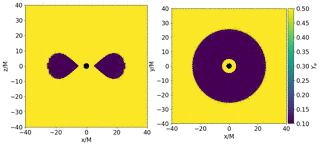

# Post neutron star merger disks

**One line description of the data:** Simulations of the aftermath of a neutron star merger.

**Longer description of the data:**

The simulations presented here are axisymmetrized snapshots of full
three-dimensional general relativistic neutrino radiation
magnetohydrodynamics. The plasma physics is treated with finite
volumes with constrained transport for the magnetic field on a
curvilinear grid. The system is closed by a tabulated nuclear equation
of state assuming nuclear statistical equilibrium (NSE). The radiation
field is treated via Monte Carlo transport, which is a particle
method. The particles are not included in this dataset, however their
effects are visible as source terms on the fluid.

**Associated paper**: The simulations included here are from a series of papers, listed below:

Miller, J. M., Ryan, B. R., & Dolence, J. C. (2019). νbhlight:
radiation GRMHD for neutrino-driven accretion flows. The Astrophysical
Journal Supplement Series, 241(2), 30.

Miller, J. M., Ryan, B. R., Dolence, J. C., Burrows, A., Fontes,
C. J., Fryer, C. L., ... & Wollaeger, R. T. (2019). Full transport
model of GW170817-like disk produces a blue kilonova. Physical Review
D, 100(2), 023008.

Miller, J. M., Sprouse, T. M., Fryer, C. L., Ryan, B. R., Dolence,
J. C., Mumpower, M. R., & Surman, R. (2020). Full transport general
relativistic radiation magnetohydrodynamics for nucleosynthesis in
collapsars. The Astrophysical Journal, 902(1), 66.

Curtis, Sanjana, et al. "Nucleosynthesis in Outflows from Black
Hole–Neutron Star Merger Disks with Full GR (ν) RMHD." The
Astrophysical Journal Letters 945.1 (2023): L13.

Lund, K. A., McLaughlin, G. C., Miller, J. M., & Mumpower,
M. R. (2024). Magnetic Field Strength Effects on Nucleosynthesis from
Neutron Star Merger Outflows. The Astrophysical Journal, 964(2), 111.

**Domain scientist**: Jonah Miller

**Code or software used to generate the data**: nubhlight. Open source
  software available at https://github.com/lanl/nubhlight

**Equation**: See equations 1-5 and 16 of Miller, Ryan, Dolence (2019).

The fluid sector consists of the following system of equations.

\begin{widetext}
\begin{eqnarray}
  \label{eq:particle:cons}
  \partial_t \paren{\detg\rho_0 u^t} + \partial_i\paren{\detg\rho_0u^i}
  &=& 0\\
  \label{eq:energy:cons}
  \partial_t\sqrbrace{\detg \paren{T^t_{\ \nu} + \rho_0u^t \delta^t_\nu}}
  + \partial_i\sqrbrace{\detg\paren{T^i_{\ \nu} + \rho_0 u^i \delta^t_\nu}}
  &=& \detg \paren{T^\kappa_{\ \lambda} \Gamma^\lambda_{\nu\kappa} + G_\nu}\ \forall \nu = 0,1,\ldots,4\\
  \label{eq:mhd:cons}
  \partial_t \paren{\detg B^i} - \partial_j \sqrbrace{\detg\paren{b^ju^i - b^i u^j}} &=& 0\\
  \label{eq:lepton:cons}
  \partial_t\paren{\detg\rho_0 Y_e u^t} + \partial_i\paren{\detg\rho_0Y_eu^i}
  &=& \detg G_{\text{ye}}
\end{eqnarray}
\end{widetext}

The the standard radiative transfer equation is
\begin{equation}
  \label{eq:radiative:transfer}
  \frac{D}{d\lambda}\paren{\frac{h^3\Inuf}{\eepsilon^3}} = \paren{\frac{h^2\etanuf}{\eepsilon^2}} - \paren{\frac{\eepsilon \chinuf}{h}} \paren{\frac{h^3\Inuf}{\eepsilon^3}},
\end{equation}

# About the data Dimension of discretized data:

A description of fields available in an output file can be found here:
https://github.com/lanl/nubhlight/wiki

- Fields available in the data:
  - Geometric quantities required for curvilinear coordinates in general realtivity, the most important of which is the 4x4 matrix at each point, the metric, which is stored in `metadata/geometry/gcon`.
  - A wide variety fo fluid quantities, including fluid rest density `RHO`, fluid internal energy `UU`, fluid velocity (in code coordinates) `U1`, `U2`, `U3`, magnetic field components (in code coordinates) `B1`, `B2`, `B3`, electron fraction Ye, artificial atmosphere mass fraction `ATM`, pressure `PRESS`, temperature `TEMP`, entropy `ENT`. Temperature is output in MeV. Entropy in kb/baryon. All other quantities are in code units.
- Number of trajectories: Currently eight full simulations. Each simulation contains roughly 200 snapshots, separated by delta t = 50 in code units. More simulations may be added later.
- Estimated size of the ensemble of all simulations: 1600 snapshots.
- Grid type Initial conditions: Constant entropy torus in hydrostatic equilibrium orbiting a black hole. Black hole mass and spin, as well as torus mass, spin, electron fraction, and entropy vary.
- Boundary conditions: Outflow
- Simulation time-step: approximately 0.01 in code units. Physical time varies; roughly 147 nanoseconds for fiducial model
- Data are stored separated by ($\Delta t$): 50 in code units. Physical time varies; roughly 0.6 milliseconds for fiducial model
- Total time range ($t_{min}$ to $t_{max}$): 10000 in code units. Physical time varies; roughly 127 milliseocnds for fudicial model
- Spatial domain size ($L_x$, $L_y$, $L_z$): Spherical coordinates. Radius roughly 2 to 1000 in code units. Physical values vary. Outer boundary is at roughly 4000 for fiducial model. Polar angle 0 to pi. Azimuthal angle 0 to 2*pi. Note that the coordinates are curvilinear. In Cartesian space, spacing is logarithmic in radius and there is a focusing of grid lines near the equator.
- Set of coefficients or non-dimensional parameters evaluated: Black hole spin parameter a, ranges 0 to 1. Initial mass and angular momentum of torus. In dimensionless units, evaluated as inner radius Rin and radius of maximum pressure Rmax. Torus initial electron fraction Ye and entropy kb. Black hole mass in solar masses.
- Approximate time to generate the data: Roughly 3 weeks per simulation on 300 cores.
- Hardware used to generate the data and precision used for generating the data: Data generated at double precision on several different supercomputers. All calculations were CPU calculations parallelized with a hybrid MPI + OpenMP strategy. 1 MPI rank per socket. Oldest calculations performed on the Los Alamos Badger cluster, now decommissioned. Intel Xeon E5-2695v5 2.1 GHz. 12 cores per socket, 24 core cores per node. Simulations run on 33 nodes. Some newer simulations run on Los Alamos Capulin cluster, now decomissioned. ARM ThunderX2 nodes. 56 cores per node. Simulation run on 33 nodes.

## Simulation Index

Scenario | Shorthand name | Description
---------+----------------+-------------
0        | collapsar_hi   | Disk resulting from collapse of massive rapidly rotating star
1        | torus_b10      | Disk inspired by 2017 observation of a neutron star merger. Highest magnetic field strength
2        | torus_b30      | Disk inspired by 2017 observation of a neutron star merger. Intermediate magnetic field strength
3        | torus_gw170817 | Disk inspired by 2017 observation of a neutron star merger. Weakest magnetic field strength
4        | torus_MBH_10   | Disk from black hole-neutron star merger. 10 solar mass black hole
5        | torus_MBH_2p31 | Disk from black hole-neutron star merger. 2.31 solar mass black hole
6        | torus_MBH_2p67 | Disk from black hole-neutron star merger. 2.76 solar mass black hole
7        | torus_MBH_2p69 | Disk from black hole-neutron star merger. 2.79 solar mass black hole
8        | torus_MBH_6    | Disk from black hole-neutron star merger. 6 solar mass black hole

## General relativistic quantities

The core quantity that describes the curvature of spacetime and its
impact on a simulation is `metadata/geometry/gcon`. From this other
quantities can be computed.

## To reproduce

The values in `metadata/settings` are sufficient to reproduce a
simulation using [nubhlight](https://github.com/lanl/nubhlight) using
the `torus_cbc` problem generator, with one exception. You must
provide tabulated equation of state and opacity data. We use the SFHo
equation of state provided on the
[stellar collapse website](https://stellarcollapse.org/).
Tabulated neutrino opacities were originally computed for the Fornax
code and are not public. However adequate open source substitutes may
be generated by the [nulib](http://www.nulib.org/) library.

## Explanation of simulation parameters

Here we include, for completeness, a description of the values in
`metadata/settings` which cover the simulation parameters chosen.

- `B_unit`, the unit of magnetic field strength. Multiplying code quantity by `B_unit` converts the quantity to units of Gauss.
- `DTd`, dump time cadence.
- `DTl`, log output time cadence.
- `DTp`, permanent restart file time cadence.
- `DTr`, temporary restart file time cadence.
- `Ledd`, (Photon) Eddington luminosity based on black hole mass.
- `L_unit`, length unit. Multiplying code quantity by `L_unit` converts it into units of cm.
- `M_unit`, mass unit. Multiplying code quantity by `M_unit` converts it into units of g.
- `Mbh`, black hole mass in units of g.
- `MdotEdd`, (Photon) Eddington accretion rate based on black hole mass.
- `N1`, number of grid points in X1 (radial) direction.
- `N2`, number of grid points in X2 (polar) direction.
- `N3`, number of grid points in X3 (azimuthal) direction.
- `PATH`, output directory for the original simulation.
- `RHO_unit`, density unit. Multiplying code quantity by `RHO_unit` converts it into units of g/cm^3.
- `Reh`, radius of the event horizon in code units.
- `Rin`, radius of the inner boundary in code units.
- `Risco`, radius of the innermost stable circular orbit in code units.
- `Rout_rad`, outer radius of neutrino transport.
- `Rout_vis`, radius used for 3D volume rendering.
- `TEMP_unit`, temperature unit. Converts from MeV (code units) to Kelvin.
- `T_unit`, time unit. Converts from code units to seconds.
- `U_unit`, energy density unit. Multiplying code quantity by `U_unit` converts it into units of erg/cm^3.
- `a`, dimensionless black hole spin. 
- `cour`, dimensionless CFL factor used to set the timestep based on the grid spacing.
- `dx`, array of grid spacing in code coordinates. (Uniform.)
- `maxnscatt`, maximum number of scattering events per superphoton particle
- `mbh`, black hole mass in solar masses.
- `hslope`, `mks_smooth`, `poly_alpha`, `poly_xt` focusing terms used for coordinate transforms
- `startx`, array of starting coordinate values for `X1`,`X2`,`X3` in code coordinates.
- `stopx`, array of ending coordinate values for `X1`,`X2`,`X3` in code coordinates.
- `tf`, final simulation time.
- `variables` list of names of primitive state vector.

# What is interesting and challenging about the data:

The 2017 detection of the in-spiral and merger of two neutron stars
was a landmark discovery in astrophysics. Through a wealth of
multi-messenger data, we now know that the merger of these
ultracompact stellar remnants is a central engine of short gamma ray
bursts and a site of r-process nucleosynthesis, where the heaviest
elements in our universe are formed. The radioactive decay of unstable
heavy elements produced in such mergers powers an optical and
infra-red transient: The kilonova.

One key driver of nucleosynthesis and resultant electromagnetic
afterglow is wind driven by an accretion disk formed around the
compact remnant. Neutrino transport plays a key role in setting the
electron fraction in this outflow, thus controlling the
nucleosynthesis.

Collapsars are black hole accretion disks formed after the core of a
massive, rapidly rotating star collapses to a black hole. These
dramatic systems rely on much the same physics and modeling as
post-merger disks, and can also be a key driver of r-processes
nucleosynthesis.

The electron fraction of material blown off from the disk is the core
"delivarable." It determines how heavy elements are synthesized, which
in turn determines the electromagnetic counterpart as observed on
Earth. This is the most important piece to get right from an emulator.
